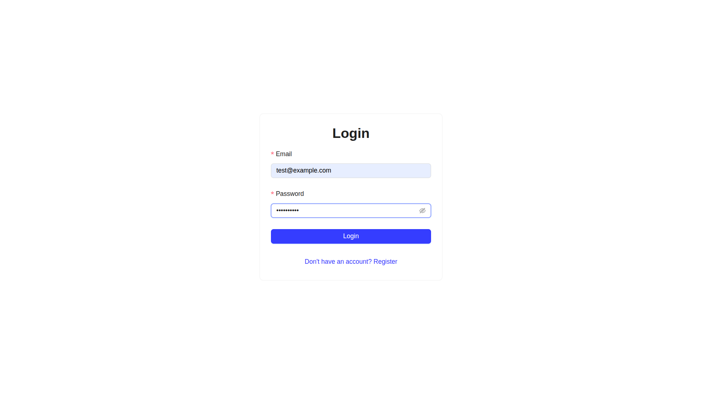
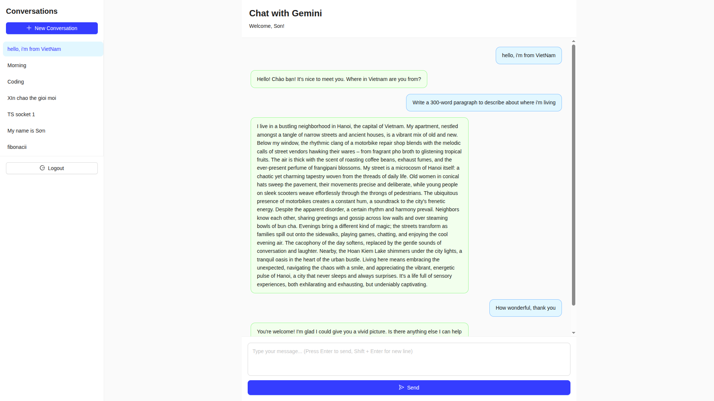

# Chat Bot Application

A real-time chat application built with React, TypeScript, Node.js, Express, Socket.IO, and PostgreSQL, integrated with Google Gemini API for conversational AI.

---

## 📸 Screenshots

<div align="center">
  
  
</div>

---

## 🏗️ System Architecture

<div align="center">
  
</div>

---

## ✨ Features

- **🔐 User Authentication**: Register, login, and logout with JWT-based authentication
- **⚡ Real-time Chat**: Send and receive messages instantly using Socket.IO, with "AI is typing..." status
- **📝 Conversation Management**: Create, rename, delete, and continue conversations
- **🧠 Context-aware Chat**: Maintains conversation history for coherent responses
- **⚖️ Token Limit**: Restricts context to ~1000 tokens to optimize cost and speed
- **📱 Responsive UI**: Built with Ant Design for a modern, user-friendly interface

---

## 🛠️ Tech Stack

### Frontend

- React
- TypeScript
- Ant Design
- Socket.IO-client
- Axios
- React-Markdown

### Backend

- Node.js
- Express
- TypeScript
- Socket.IO
- Sequelize
- PostgreSQL

### AI & Database

- **AI**: Google Gemini API (gemini-1.5-flash)
- **Database**: PostgreSQL (Dockerized)
- **Authentication**: JWT (JSON Web Tokens)

---

## 📋 Prerequisites

- **Docker** & **Docker Compose** installed
- **Google Gemini API key** (free tier available)

---

## 🚀 Quick Start with Docker

### 1. Clone the Repository

```bash
git clone https://github.com/son26704/chat_bot.git
cd chat_bot
```

### 2. Setup Environment Variables

Create a `.env` file at the **root** of the project (same level as `docker-compose.yml`):

```env
DB_PASSWORD=your_postgres_password
JWT_SECRET=your_jwt_secret
GEMINI_API_KEY=your_gemini_api_key
```

> **Note:**
>
> - `DB_PASSWORD` is required for the Postgres container.
> - `JWT_SECRET` is used for authentication.
> - `GEMINI_API_KEY` is your Google Gemini API key.

You can also copy and edit the provided example if available:

```bash
cp .env.example .env
```

### 3. Start All Services

```bash
docker-compose up --build
```

- This will build and start the PostgreSQL, backend server, and frontend client containers.
- The first run may take a few minutes to pull images and install dependencies.

### 4. Access the Application

- **Frontend:** [http://localhost:5173](http://localhost:5173)
- **Backend API:** [http://localhost:3000/api](http://localhost:3000/api)
- **WebSocket:** [http://localhost:3000](http://localhost:3000)

---

## 🛑 Stopping and Data Persistence

- To stop all services (but keep data):
  ```bash
  docker-compose down
  ```
- To stop and **remove all data** (Postgres database will be reset):
  ```bash
  docker-compose down -v
  ```

---

## 🧪 Manual Testing Checklist

- [ ] **Real-time Chat**: Send a message and verify "AI is typing..." appears, followed by a response from Gemini
- [ ] **Multi-tab Support**: Open multiple browser tabs, log in with the same account, and send messages to confirm updates across tabs
- [ ] **Conversation Management**: Create, rename, or delete conversations from the sidebar
- [ ] **Token Limit**: Send multiple long messages to ensure responses remain fast

---

## 📁 Project Structure

```
chat_bot/
├── client/                     # Frontend (React, TypeScript)
│   ├── src/
│   │   ├── pages/             # React components (LoginPage, ChatPage, etc.)
│   │   ├── services/          # API and Socket.IO services
│   │   ├── hooks/             # Custom hooks (useAuth)
│   │   ├── types/             # TypeScript interfaces
│   │   └── index.css          # Global styles
├── server/                     # Backend (Node.js, Express, TypeScript)
│   ├── src/
│   │   ├── controllers/       # API controllers
│   │   ├── db/                # Database configuration (Sequelize)
│   │   ├── models/            # Database models (User, Conversation, Message)
│   │   ├── routes/            # API routes
│   │   ├── services/          # Business logic (auth, chat, Gemini)
│   │   ├── socket.ts          # Socket.IO configuration
│   │   └── index.ts           # Server entry point
├── docker-compose.yml          # Docker Compose configuration
├── .env                        # Root environment variables for Docker Compose
└── README.md
```

---

## 📝 Notes

- **No need to install Node.js, npm, or PostgreSQL locally** – everything runs in Docker.
- **Data is persisted** in Docker volumes unless you run `docker-compose down -v`.
- For development, code changes in `client/` and `server/` will hot-reload if volumes are mounted (default in most setups).
- For production deployment, consider building optimized images and using environment-specific settings.

---

## 📞 Support

If you encounter issues, please open an issue on the repository or contact the maintainer.

---
